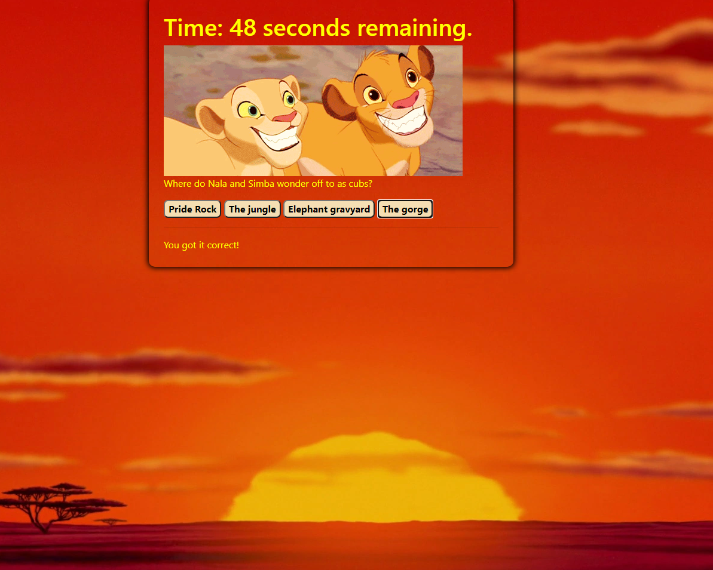

# The Lion King Quiz Game

### General Information
This is a time quiz to test your knowledge on Lion King! There is a total time of 60 seconds, each correct asnwer in the quiz will grant +10 points, each incorrect answer will subtract 5 seconds off the timer. The user is prompted to enter their name at the end of the quiz or when the timer reaches 0. The total points of the user is the combination of the total points earned and the remaining time left!

### Technologies
- [JavaScript](https://www.javascript.com/)
- [Bootstrap}(https://getbootstrap.com/)

### Screen shots

### Author
- Jae Kim

### License
- MIT
